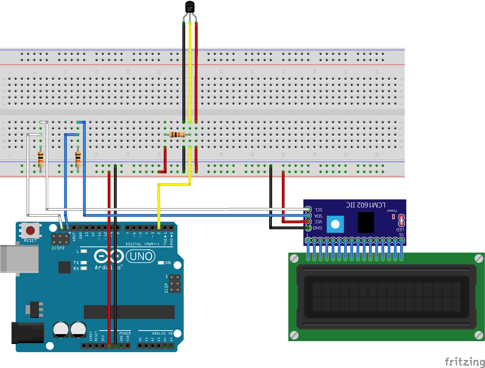
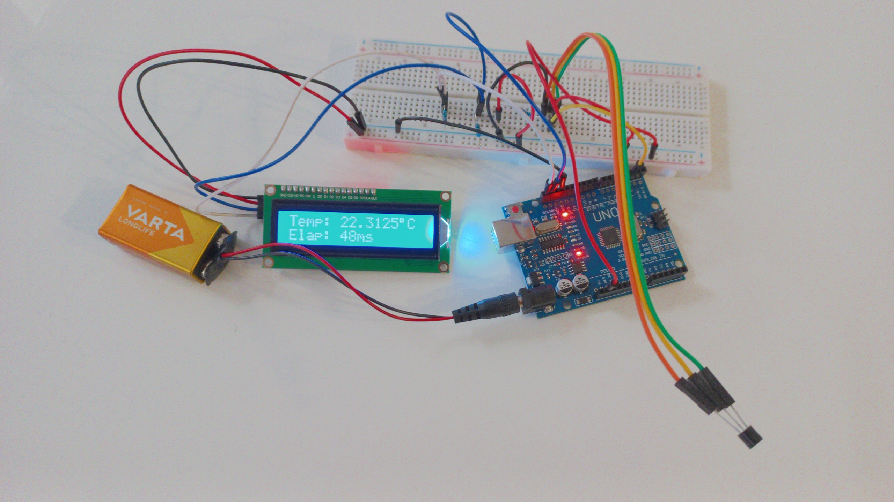

# ATMega328PThermometer
Reads temperature from the DS18B20 sensor and displays it on the HD44780 LCD.
Written in C using the avr-libc library.

## Sample schematic


## Picture


## Compilation and uploading
Note: replace \<port\> with the serial port your PCB is connected to. For example, `/dev/ttyUSB0`.
```
$ git clone https://github.com/GRAPHENE9932/atmega328p_thermometer.git
$ cd atmega328p_thermometer
$ mkdir build
$ cd build
$ cmake -DCMAKE_BUILD_TYPE=Release -G Ninja -DPROG_PORT=<port> ..
$ ninja
$ ninja upload
```

### Redefining the default ports
#### Defaults
| Pin purpose | Default PORT | Default bit number | Arduino's digital port
| ----------- | ------------ | ------------------ | ----------------------
| I²C SDA     | PORTC        | 4                  | SDA
| I²C SCL     | PORTC        | 5                  | SCL
| DS18B20 DQ  | PORTD        | 2                  | 2

#### I²C  ports
To change the default I²C ports you must run the cmake command with these extra arguments:

```
-DREDEFINED_I2C_PORTS=1
-DSDA_PORT=<port>
-DSDA_DDR=<ddr>
-DSDA_PORT_BIT=<bit>
-DSCL_PORT=<port>
-DSCL_DDR=<ddr>
-DSCL_PORT_BIT=<bit>
```

For example, to change the I²C SDA and SCL ports to Arduino's 9th and 10th digital pins respectively this cmake command must be run:

```
cmake -DCMAKE_BUILD_TYPE=Release -G Ninja -DPROG_PORT=/dev/ttyUSB0 -DREDEFINED_I2C_PORTS=1 -DSDA_PORT=PORTB -DSDA_DDR=DDRB -DSDA_PORT_BIT=1 -DSCL_PORT=PORTB -DSCL_DDR=DDRB -DSCL_PORT_BIT=2 ..
```

#### DS18B20 port
To change the default DS18B20 DQ port you must run the cmake command with these extra arguments:

```
-DREDEFINED_DS18B20_PORT=1
-DDS18B20_PORT=<port>
-DDS18B20_DDR=<ddr>
-DDS18B20_PIN=<pin>
-DDS18B20_PORT_BIT=<bit>
```

For example, to change the DS18B20 DQ port to Arduino's 5th digital pin this cmake command must be run:

```
cmake -DCMAKE_BUILD_TYPE=Release -G Ninja -DPROG_PORT=/dev/ttyUSB0 -DREDEFINED_DS18B20_PORT=1 -DDS18B20_PORT=PORTD -DDS18B20_DDR=DDRD -DDS18B20_PIN=PIND -DDS18B20_PORT_BIT=5 ..
```